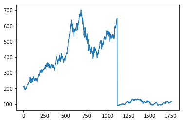

## Presentation of recurrent neural networks

A *network of recurrent neurons* is a network of artificial neurons with recurrent connections, there is a cycle in the network that consists of the return of an outgoing information from a neuron as a new variable. incoming from this same neuron.


A *Long Short-Term Memory (LSTM)* network is a network of recurrent neurons whose memory alternates between short-term and long-term. It is the architecture most used for this kind of networks, and which makes it possible to face the problem of disappearance of the gradient. Indeed, each neuron in the network is linked to two tasks: a "hidden" state and a memory state.


## Work approach

This work is based on https://github.com/llSourcell/How-to-Predict-Stock-Prices-Easily-Demo and http://machinelearningmastery.com/time-series-prediction-lstm-recurrent-neural-networks-python-keras/

I just want to predict if a stock will rise or not based on previous information using LSTM network

```python
import numpy as np # linear algebra
import pandas as pd # data processing, CSV file I/O (e.g. pd.read_csv)

from subprocess import check_output
from keras.layers.core import Dense, Activation, Dropout
from keras.layers.recurrent import LSTM
from keras.models import Sequential
from sklearn.cross_validation import  train_test_split
import time #helper libraries
from sklearn.preprocessing import MinMaxScaler
import matplotlib.pyplot as plt
from numpy import newaxis
```

    Using TensorFlow backend.
    C:\Users\ordinateur\Anaconda3\lib\site-packages\sklearn\cross_validation.py:41: DeprecationWarning: This module was deprecated in version 0.18 in favor of the model_selection module into which all the refactored classes and functions are moved. Also note that the interface of the new CV iterators are different from that of this module. This module will be removed in 0.20.
      "This module will be removed in 0.20.", DeprecationWarning)
    


```python
prices_dataset =  pd.read_csv('C:\\Users\ordinateur\Desktop\prices.csv', header=0)
prices_dataset
```


<div>
<style>
    .dataframe thead tr:only-child th {
        text-align: right;
    }

    .dataframe thead th {
        text-align: left;
    }

    .dataframe tbody tr th {
        vertical-align: top;
    }
</style>
<table border="1" class="dataframe">
  <thead>
    
  </thead>
  <tbody>
  </tbody>
</table>
<p>851264 rows × 7 columns</p>
</div>


```python
apple = prices_dataset[prices_dataset['symbol']=='AAPL']
apple_stock_prices = apple.close.values.astype('float32')
apple_stock_prices = apple_stock_prices.reshape(1762, 1)
apple_stock_prices.shape
```


    (1762, 1)


```python
plt.plot(apple_stock_prices)
plt.show()

scaler = MinMaxScaler(feature_range=(0, 1))
apple_stock_prices = scaler.fit_transform(apple_stock_prices)
```





```python
train_size = int(len(apple_stock_prices) * 0.80)
test_size = len(apple_stock_prices) - train_size
train, test = apple_stock_prices[0:train_size,:], apple_stock_prices[train_size:len(apple_stock_prices),:]
print(len(train), len(test))
```

    1409 353
    


```python
def create_dataset(dataset, look_back=1):
	dataX, dataY = [], []
	for i in range(len(dataset)-look_back-1):
		a = dataset[i:(i+look_back), 0]
		dataX.append(a)
		dataY.append(dataset[i + look_back, 0])
	return np.array(dataX), np.array(dataY)
```


```python
look_back = 1
trainX, trainY = create_dataset(train, look_back)
testX, testY = create_dataset(test, look_back)
```


```python
trainX = np.reshape(trainX, (trainX.shape[0], 1, trainX.shape[1]))
testX = np.reshape(testX, (testX.shape[0], 1, testX.shape[1]))
```


```python
model = Sequential()

model.add(LSTM(
    input_dim=1,
    output_dim=50,
    return_sequences=True))
model.add(Dropout(0.2))

model.add(LSTM(
    100,
    return_sequences=False))
model.add(Dropout(0.2))

model.add(Dense(
    output_dim=1))
model.add(Activation('linear'))

start = time.time()
model.compile(loss='mse', optimizer='rmsprop')
print ('compilation time : ', time.time() - start)
```

    C:\Users\ordinateur\Anaconda3\lib\site-packages\ipykernel_launcher.py:6: UserWarning: The `input_dim` and `input_length` arguments in recurrent layers are deprecated. Use `input_shape` instead.
      
    C:\Users\ordinateur\Anaconda3\lib\site-packages\ipykernel_launcher.py:6: UserWarning: Update your `LSTM` call to the Keras 2 API: `LSTM(return_sequences=True, input_shape=(None, 1), units=50)`
      
    

    compilation time :  0.04689431190490723
    

    C:\Users\ordinateur\Anaconda3\lib\site-packages\ipykernel_launcher.py:15: UserWarning: Update your `Dense` call to the Keras 2 API: `Dense(units=1)`
      from ipykernel import kernelapp as app
    


```python
model.fit(
    trainX,
    trainY,
    batch_size=128,
    nb_epoch=10,
    validation_split=0.05)
```

    C:\Users\ordinateur\Anaconda3\lib\site-packages\keras\models.py:939: UserWarning: The `nb_epoch` argument in `fit` has been renamed `epochs`.
      warnings.warn('The `nb_epoch` argument in `fit` '
    

    Train on 1336 samples, validate on 71 samples
    Epoch 1/10
    1336/1336 [==============================] - 4s 3ms/step - loss: 0.2311 - val_loss: 0.0020
    Epoch 2/10
    1336/1336 [==============================] - 0s 99us/step - loss: 0.1247 - val_loss: 0.0214
    Epoch 3/10
    1336/1336 [==============================] - 0s 97us/step - loss: 0.0538 - val_loss: 0.0553
    Epoch 4/10
    1336/1336 [==============================] - 0s 82us/step - loss: 0.0303 - val_loss: 0.0654
    Epoch 5/10
    1336/1336 [==============================] - 0s 94us/step - loss: 0.0240 - val_loss: 0.0559
    Epoch 6/10
    1336/1336 [==============================] - 0s 122us/step - loss: 0.0183 - val_loss: 0.0341
    Epoch 7/10
    1336/1336 [==============================] - 0s 114us/step - loss: 0.0116 - val_loss: 0.0155
    Epoch 8/10
    1336/1336 [==============================] - 0s 124us/step - loss: 0.0069 - val_loss: 0.0066
    Epoch 9/10
    1336/1336 [==============================] - 0s 115us/step - loss: 0.0046 - val_loss: 0.0022
    Epoch 10/10
    1336/1336 [==============================] - 0s 116us/step - loss: 0.0037 - val_loss: 5.5833e-04
    


    <keras.callbacks.History at 0x2a3d7ffdd8>


```python
def plot_results_multiple(predicted_data, true_data,length):
    plt.plot(scaler.inverse_transform(true_data.reshape(-1, 1))[length:])
    plt.plot(scaler.inverse_transform(np.array(predicted_data).reshape(-1, 1))[length:])
    plt.show()
    
#predict lenght consecutive values from a real one
def predict_sequences_multiple(model, firstValue,length):
    prediction_seqs = []
    curr_frame = firstValue
    
    for i in range(length): 
        predicted = []        
        
        print(model.predict(curr_frame[newaxis,:,:]))
        predicted.append(model.predict(curr_frame[newaxis,:,:])[0,0])
        
        curr_frame = curr_frame[0:]
        curr_frame = np.insert(curr_frame[0:], i+1, predicted[-1], axis=0)
        
        prediction_seqs.append(predicted[-1])
        
    return prediction_seqs

predict_length=5
predictions = predict_sequences_multiple(model, testX[0], predict_length)
print(scaler.inverse_transform(np.array(predictions).reshape(-1, 1)))
plot_results_multiple(predictions, testY, predict_length)
```

    [[ 0.07359067]]
    [[ 0.1730205]]
    [[ 0.36703554]]
    [[ 0.77842444]]
    [[ 1.72563553]]
    [[  135.304245  ]
     [  196.13742065]
     [  314.83969116]
     [  566.53564453]
     [ 1146.05847168]]
    


